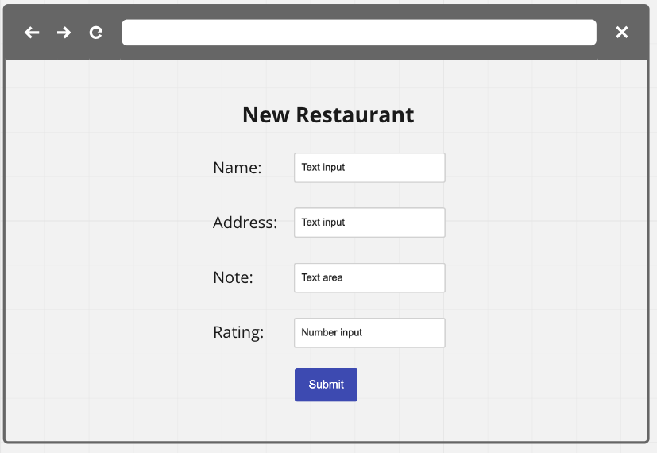
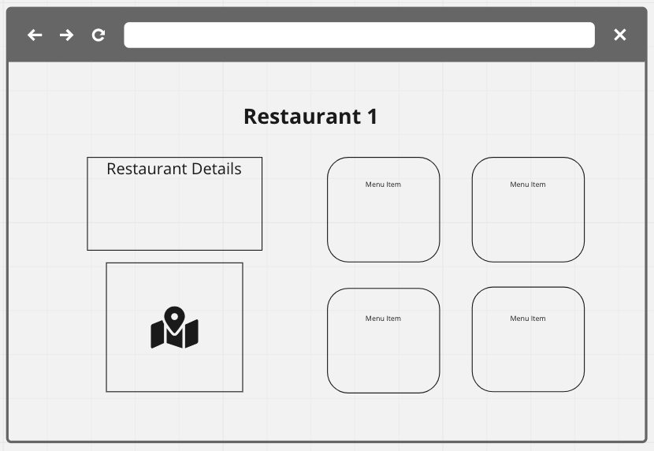
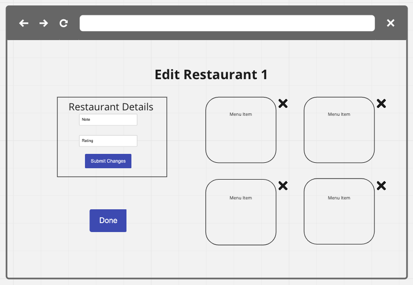
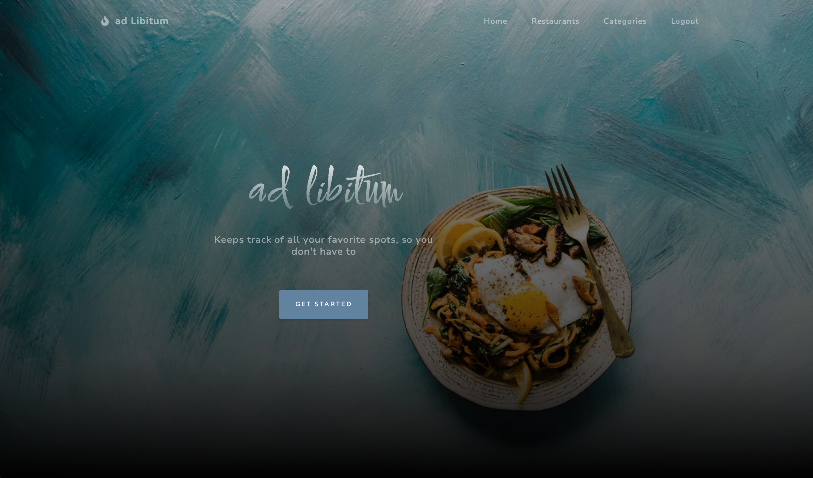
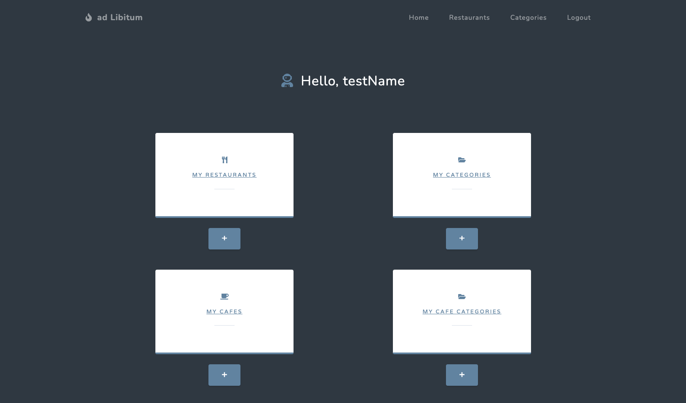
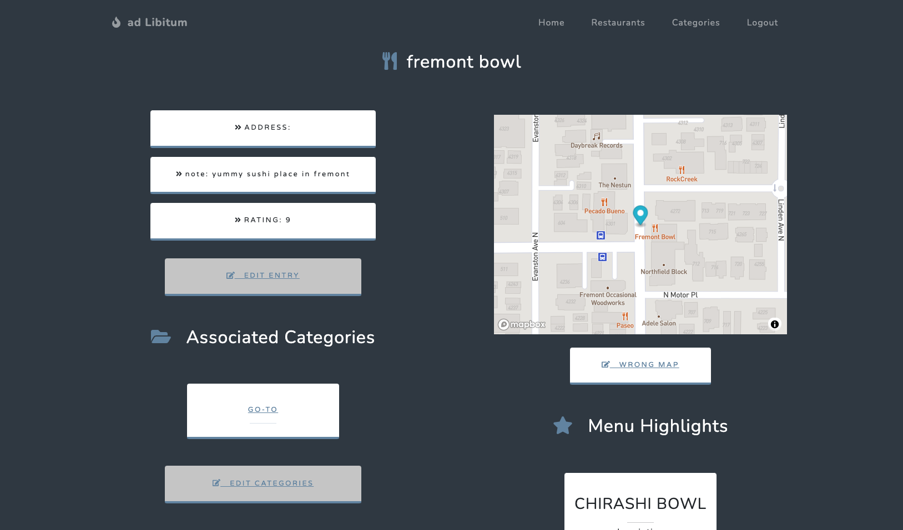

# ad Libitum

## Project Idea and Description
 - A fullstack application that allows users to save their favorite restaurants for future reference! Users can also save their favorite menu items and record notes on their experience.
 
As a lover of food and gatherings with family and close friends, I have for years kept sporadic, unorganized lists in my phone as an attempt to remember restaurants, cafes, and bars that I thoroughly enjoyed visiting. Whether it was due to the food, customer service, ambience, or just great company, there are just some times when it is too good not to come back. During those good times, who really wants to sit on their phones looking for their list that's buried in a notes app with hundres of other random rambling thoughts? ad-Libitum aims to consolidate your lists into one place and get you back to what's really important. Quickly add new locations with just the name and/or address and, if you'd like, a short note about why it was so great. You can also keep track of menu items you don't want to forget and organize restaurants and cafes into custom categories for easy access later on.

## Installation Instructions

- Fork and clone code to desired directory, then run `npm i` to install dependencies:
    <details>
      <summary> list </summary>

      - axios
      - bcrypt
      - colors
      - cookie-parser
      - crypto-js
      - dotenv
      - ejs
      - express
      - express-ejs-layouts
      - mapbox-gl
      - method-override
      - pg
      - sequelize
      - sequelize-cli

    </details>

- Run `createdb pangs`(edit config.json if custom database name is desired) in your terminal 
    - Above command is for Macs (developers should use the analogous command and make appropriate modifications to config.json based on their OS and Postgres)
- Run `sequelize db:migrate` in your terminal to create the necessary tables
- In browser, go to https://account.mapbox.com/auth/signup and sign up for a free account for the Mapbox Geocoding API
- Create a `.env` file in the root directory
- Copy the provided API key into the file along with the port and encryption string
- The `.env` file should look like this
```
MAPBOX_API_TOKEN=<yourApiKey>
SECRET=<wordOfYourChoice>
PORT=<portOfYourChoice>
```

## Link to Current Version

[ad-Libitum on Heroku](https://ad-libitum-deploy.herokuapp.com)

## Technologies Used
- HTML
- CSS/Boostrap
- JavaScript
- PostgreSQL (PostGIS ext.)
- Node.js
- Express
- Sequelize
- Mapbox GL JS

## Development Approach

### User Stories
- As a user, I want to save restaurants to a list so that I have a reference if I want to visit again.
- As a user, I want to save menu items I've enjoyed in the past so I always know what to order when I'm not feeling adventurous.
- As a user, I want to leave notes about my favorite restaurants so I can remember why I enjoyed it so much.
- As a user, I want to see a map of exactly where the restaurant is so I can find it easily once I've parked. 
- As a user, I want to edit my notes about restaurants in case my opinion changes.
- As a user, I want to delete restaurants from my list if they are no longer good.
- As a user, I want to make custom categories to sort my favorite restaurants.

### ERD


### RESTful Routing Chart

| Method | Path | Purpose |
| ------ | -------------- | -------------------------------- |
| GET | `/` | Display landing page |
| GET | `/users/new` | Display new user form |
| POST | `/users` | Creates a new user in db or display error message and re-render `GET /users/new` if it already exists |
| GET | `/users/login` | Display login form or redirect to profile page if logged in |
| GET | `/users/profile` | Display user home page with location types and categories |
| POST | `/users/login` | Log user in if information is correct, display error message if not |
| GET | `/users/logout` | Log user out, clear cookie, and redirect to landing page |
| GET | `/restaurants` | Display a list of saved restaurants |
| POST | `/restaurants` | Creates a new restaurant, then redirects back to `GET /restaurants`, display error message and re-render form if it already exists |
| GET | `/restaurants/new` | Display a form for adding a new restaurant |
| PUT | `/restaurants/:id` | Updates details about a restaurant |
| GET | `/restaurants/edit/:id` | Display an editable form for the details of a restaurant |
| GET | `/restaurants/:id/map` | Display a form to search for a new map |
| GET | `/restaurants/mapresults` | Display a list of search results for new map |
| PUT | `/restaurants/:id/map` | Updates coordinates column in restaurant table, to be used for map on details page |
| POST | `restaurants/:id` | Creates a new menu item, then redirects back to `GET /restaurants/:id`, display error message if it already exists|
| GET | `/restaurants/:id/newmenu` | Display a form for adding a new menu item |
| GET | `/restaurants/:id` | Display details of a restaurant including note, map, and highlight menu items |
| GET | `/restaurants/:id/addcategory` | Display a page with category toggler and a form for adding restaurant to a new category |
| POST | `/restaurants/:id/addcategory` | Create a new category and create an entry in the join table to associated category with restaurant, display error message if it already exists |
| DELETE | `/restaurants/:id/rmfrom/:categoryId` | Delete an entry in the join table to dissociate category from restaurant, re-render toggler screen |
| POST | `/restaurants/:id/addto/:categoryId` | Create an entry in the join table to associate category to restaurant, re-render toggler screen |
| DELETE | `/restaurants/:id` | Deletes the specified restaurant entry in db and redirects to `GET /restaurants` |
| DELETE | `/restaurants/:restaurantId/:menuId` | Deletes the specified highlight menu item entry in db and redirects to the parent restaurant details page |
| GET | `/categories` | Display a list of categories that belong to the user |
| POST | `/categories` | Creates a new category, then redirects back to `GET /categories`, display error message and re-render form if it already exists|
| GET | `/categories/1new` | Display a form for adding a new category |
| GET | `/categories/:name` | Display a list of restaurants in category |
| DELETE | `/categories/:name` | Deletes the specified category, then redirects back to `GET /categories` |

<details>
  <summary>Cafe Routes Analogous to Restaurant Routes</summary>

| Method | Path | Purpose |
| ------ | -------------- | -------------------------------- |
| GET | `/cafes` | Display a list of saved cafes |
| POST | `/cafes` | Creates a new cafe, then redirects back to `GET /cafes`, display error message and re-render form if it already exists |
| GET | `/cafes/new` | Display a form for adding a new cafe |
| PUT | `/cafes/:id` | Updates details about a cafe |
| GET | `/cafes/edit/:id` | Display an editable form for the details of a cafe |
| GET | `/cafes/:id/map` | Display a form to search for a new map |
| GET | `/cafes/mapresults` | Display a list of search results for new map |
| PUT | `/cafes/:id/map` | Updates coordinates column in cafe table, to be used for map on details page |
| POST | `cafes/:id` | Creates a new menu item, then redirects back to `GET /cafes/:id`, display error message if it already exists|
| GET | `/cafes/:id/newmenu` | Display a form for adding a new menu item |
| GET | `/cafes/:id` | Display details of a cafe including note, map, and highlight menu items |
| GET | `/cafes/:id/addcategory` | Display a page with category toggler and a form for adding cafe to a new category |
| POST | `/cafes/:id/addcategory` | Create a new category and create an entry in the join table to associated category with cafe, display error message if it already exists |
| DELETE | `/cafes/:id/rmfrom/:categoryId` | Delete an entry in the join table to dissociate category from cafe, re-render toggler screen |
| POST | `/cafes/:id/addto/:categoryId` | Create an entry in the join table to associate category to cafe, re-render toggler screen |
| DELETE | `/cafes/:id` | Deletes the specified cafe entry in db and redirects to `GET /cafes`|
| DELETE | `/cafes/:cafeId/:menuId` | Deletes the specified highlight menu item entry in db and redirects to the parent cafe details page |
| GET | `/ccategories` | Display a list of categories that belong to the user |
| POST | `/ccategories` | Creates a new category, then redirects back to `GET /ccategories`, display error message and re-render form if it already exists|
| GET | `/ccategories/1new` | Display a form for adding a new category |
| GET | `/ccategories/:name` | Display a list of restaurants in category |
| DELETE | `/ccategories/:name` | Deletes the specified category, then redirects back to `GET /ccategories` |

</details>

### Wireframes
<details>
  <summary>Display</summary>

- Welcome Page

- User Page

- Restaurant/Categories List 

- Restaurant/Categories/Menu Item New

- Restaurant Details Page

- Entry Edit Page


</details>

## MVP Goals
- [x] Welcome home page that renders login/signup
- [x] User profile page that displays user's saved restaurants - ended up having a separate profile page and indices for each type of location
- [x] User will be able to access a details page for each restaurant, which will contain:
  - [x] A note made by user, which can be edited if needed
  - [x] A map of the immediate vicinity of the restaurant
  - [x] Favorite menu items from the restaurant
- [x] User will be able to create custom categories to organize the list of restaurants (e.g. "Go-To", "Comfort", "Sushi All-stars", "Too Pricey for Tuesday")

## Product Screenshots (v1.0)
<details>
  <summary>Display</summary>

- Landing Page

- New User Page

- User Profile Page

- Location/Categories List Page

- Location Details Page

- Location Edit Page

- Category Toggler/Edit Page

- Edit Map Results Page


</details>

## Stretch Goals
- [x] Responsive design for use on various screen sizes
- [x] Implement a method to change the map if the first attempt was incorrect (designed this way to quickly add a favorite place without having to get past a search screen)
- [x] Other user lists (e.g. cafes, bars, dessert spots, etc.) - more to be added
- [ ] User created groups to connect to other users (e.g. Family Favorites, Homie Favorites)
  - Add M:N linking groups (with attribute name) to users table and view that displays list of places that have been added by everyone in the group (later add a details page that links to recommended menu items)
- [ ] Randomized restaurant/menu item picker
- [ ] Display ETA/estimated distance/embedded navigation link (for mobile)
- [ ] Ability to add user photos for restaurant or menu items (Not sure if possible with just postgres)

### Post-project Reflection
Overall, I would say that I am proud of what I was able to put together in a week's time! There were definitely times during the build that left me frustrated or stumped, but they ended up becoming great teaching moments as they led me to rabbit-holes of thought experiments and provided an opportunity to learn some of the intricacies of the many technologies available. Really starting to love the open-source culture of software development. There were many stretch goals that I could not get to quite yet, but I believe the additions of these features over time will really flesh out this project. In terms of user interface, adding an edit page directly connected to the category list page will likely improve user experience and flow. The final proof-of-concept implementation of the Cafe and Cafe Categories models leaves a lot to be desired in terms of concision for the time being, but I have some ideas on a cleaner solution.

## Resources
- Mapbox Geocoding API/Mapbox GL JS (https://docs.mapbox.com/)
- Stack Overflow: postgis psql extension for geometry data type
- (https://sequelize.org/v6/)
- (https://devcenter.heroku.com/categories/reference)
- (https://app.diagrams.net/)
- (https://fontawesome.com/icons)
- (https://icons8.com/)
- (https://startbootstrap.com/)
- (https://getbootstrap.com/)
- (https://unsplash.com/)
- (https://animate.style/)
